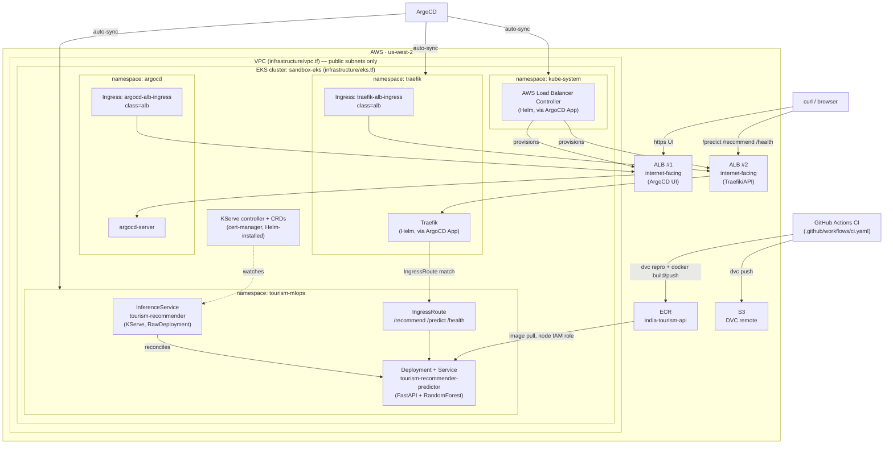

# India Tourism Recommender — MLOps Project

An ML-powered FastAPI service that recommends **which Indian destinations to
visit in which month**, based on climate (temperature, rainfall), category
(hill station, beach, heritage, wildlife, spiritual, backwaters, desert,
city), and budget — deployed end-to-end on EKS with DVC, KServe, ArgoCD,
and an ALB Ingress.

Repo: `Harsha1309/MLOps-Project`

---

## How the model works

1. **Dataset** (`src/tourism_api/pipeline/build_dataset.py` → `data/india_tourism.csv`)
   56 popular Indian destinations × 12 months = **672 rows**. Each row has:
   `place, state, category, region, month, avg_temp_c, avg_rainfall_mm,
   cost_tier, is_best_month, suitability_score`.
   Temperature/rainfall are generated from realistic seasonal curves per
   region (monsoon June–Sep, winter peak Jan, summer peak May/June, cold
   high-altitude baselines for Himalayan places, etc.), and
   `suitability_score` (0–10) is a heuristic label combining temperature
   comfort, rainfall penalty, and known best-season boosts.

2. **Training** (`src/tourism_api/pipeline/train.py` → `models/tourism_model.joblib`)
   A `RandomForestRegressor` inside a `scikit-learn` `Pipeline`
   (one-hot encoding for `category`/`region` + passthrough numeric features)
   learns to predict `suitability_score` from
   `avg_temp_c, avg_rainfall_mm, cost_tier, month_num, category, region`.
   Achieves **R² ≈ 0.96 / MAE ≈ 0.26** on a held-out 20% test split.

3. **API** (`src/tourism_api/api/main.py`) serves the trained model plus a lookup table of all
   place/month combinations, so it can score and rank real destinations for
   whatever month/filters the user asks for.

### Endpoints

| Method | Path         | Purpose                                                  |
|--------|--------------|-----------------------------------------------------------|
| GET    | `/`          | Service info                                               |
| GET    | `/health`    | Health check (model loaded? row count)                     |
| GET    | `/months`    | List valid month names                                     |
| GET    | `/places`    | List destinations (optional `category`, `state` filter)    |
| POST   | `/predict`   | Suitability score for one `place` + `month`                |
| POST   | `/recommend` | Top-N destinations for a `month`, given filters             |

### Local dev

```bash
pip install -r requirements.txt
pip install -e .

# 1. Build the dataset
python src/tourism_api/pipeline/build_dataset.py

# 2. Train the model
python src/tourism_api/pipeline/train.py

# 3. Run the API
uvicorn tourism_api.api.main:app --reload --port 8000
```

Open interactive docs at **http://127.0.0.1:8000/docs**.

```bash
# smoke tests (no server needed)
python tests/test_api.py

curl -X POST http://127.0.0.1:8000/predict \
  -H "Content-Type: application/json" \
  -d '{"place": "Manali", "month": "June"}'

curl -X POST http://127.0.0.1:8000/recommend \
  -H "Content-Type: application/json" \
  -d '{
        "month": "December",
        "category": "Beach",
        "min_temp_c": 15,
        "max_temp_c": 30,
        "max_cost_tier": 2,
        "top_n": 5
      }'
```

---

## Project structure

```
MLOps-Project/
├── src/
│   └── tourism_api/
│       ├── api/
│       │   └── main.py           # FastAPI app
│       └── pipeline/
│           ├── build_dataset.py  # generates data/india_tourism.csv
│           └── train.py          # trains model -> models/tourism_model.joblib
├── tests/
│   └── test_api.py               # smoke tests
├── docker/
│   └── Dockerfile
├── pyproject.toml                # makes src/ an installable package
├── requirements.txt
├── dvc.yaml / dvc.lock           # DVC pipeline
├── data/
│   └── india_tourism.csv
├── models/
│   ├── tourism_model.joblib
│   ├── lookup_table.pkl
│   └── metrics.json
├── .github/workflows/ci.yaml     # DVC repro + Docker build/push to ECR
├── infrastructure/                # Terraform: VPC, EKS, ECR, IAM/IRSA, S3 backend
│   ├── vpc.tf
│   ├── eks.tf
│   ├── oidc.tf
│   ├── alb-controller-irsa.tf
│   ├── ecr.tf
│   ├── s3.tf
│   └── outputs.tf
└── gitops/
    ├── apps/                         # ArgoCD Application manifests (app-of-apps layer)
    │   ├── tourism-recommender.yaml  # ArgoCD App -> gitops/charts/tourism-recommender
    │   ├── mlflow.yaml               # ArgoCD App -> gitops/charts/mlflow
    │   ├── argocd-ingress.yaml       # ALB Ingress for ArgoCD UI
    │   ├── aws-lb-controller.yaml    # ArgoCD App: AWS LB Controller (Helm)
    │   └── traefik.yaml              # ArgoCD App: Traefik (Helm)
    └── charts/                       # actual workload manifests, per app
        ├── mlflow/
        │   ├── namespace.yaml
        │   ├── deployment.yaml
        │   ├── ingress.yaml
        │   ├── service-account.yaml
        │   ├── secret-provider.yaml
        │   └── csi-rbac.yaml
        └── tourism-recommender/
            ├── namespace.yaml            # namespace + tourism-dvc-sa (IRSA)
            ├── inference-service.yaml    # KServe InferenceService
            ├── ingress-route.yaml        # Traefik IngressRoute -> predictor
            └── ingress.yaml              # ALB Ingress -> Traefik Service
```

---

## Architecture



**Why RawDeployment mode for KServe:** the sandbox cluster is small on
purpose (public subnets only, `t3.medium` nodes, capped instance count —
see `infrastructure/variables.tf`). Knative + Istio (KServe's default
"Serverless" mode) adds a control plane most sandbox clusters don't have
headroom for. `serving.kserve.io/deploymentMode: RawDeployment` makes
KServe manage a plain Deployment/Service/HPA instead — the trade-off is no
scale-to-zero and no Knative revisions.

**Two separate ALBs:** the ArgoCD UI Ingress and the Traefik/API Ingress
each provision their own internet-facing ALB, since they're separate
`Ingress` objects in separate namespaces with no shared `IngressGroup`
annotation.

---

## Full setup — step by step

### 1. Provision the cluster

```bash
cd infrastructure
terraform init
terraform apply
aws eks update-kubeconfig --region us-west-2 --name sandbox-eks
```

Capture two outputs you'll need below:

```bash
terraform output vpc_id
terraform output dvc_irsa_role_arn
```

### 2. Install cert-manager (needed by both KServe and the ALB controller webhook)

```bash
kubectl apply -f https://github.com/cert-manager/cert-manager/releases/latest/download/cert-manager.yaml
kubectl wait --for=condition=Available -n cert-manager deployment --all --timeout=180s
```

### 3. Install ArgoCD (not covered in either original README — needed before anything else in `gitops/` can sync)

```bash
kubectl create namespace argocd
kubectl apply -n argocd -f https://raw.githubusercontent.com/argoproj/argo-cd/stable/manifests/install.yaml
kubectl wait --for=condition=Available -n argocd deployment --all --timeout=300s
```

Or via Helm, if you'd rather manage it the same way as the other cluster add-ons:

```bash
helm repo add argo https://argoproj.github.io/argo-helm
helm repo update
helm install argocd argo/argo-cd \
  --namespace argocd \
  --create-namespace \
  --version 7.7.11
```

Get the initial admin password:

```bash
kubectl -n argocd get secret argocd-initial-admin-secret \
  -o jsonpath="{.data.password}" | base64 -d
```

ArgoCD's server redirects HTTP→HTTPS by default. Since this setup exposes
it over a plain HTTP ALB (no TLS listener), disable that redirect:

```bash
kubectl patch configmap argocd-cmd-params-cm -n argocd --type merge \
  -p '{"data":{"server.insecure":"true"}}'
kubectl rollout restart deployment argocd-server -n argocd
```

### 4. Deploy the AWS Load Balancer Controller + Traefik via ArgoCD

Before applying, confirm `gitops/apps/aws-lb-controller.yaml` has a
single, clean `Application` document with `vpcId` matching your current
`terraform output vpc_id` — this file has broken in the past (two
concatenated documents with stale/conflicting VPC IDs), which prevents the
controller from installing or discovering subnets correctly.

```bash
kubectl apply -f gitops/apps/aws-lb-controller.yaml
kubectl apply -f gitops/apps/traefik.yaml

# confirm both are healthy before continuing
kubectl get pods -n kube-system -l app.kubernetes.io/name=aws-load-balancer-controller
kubectl get pods -n traefik
kubectl get ingressclass
```

### 4a. Install Secrets Store CSI Driver for MLflow

MLflow uses AWS Secrets Manager through the Secrets Store CSI Driver. Install
the driver and the AWS provider as two independent releases, each with its
own ServiceAccount — do not try to make the provider chart reuse the
driver's ServiceAccount; forcing that causes a Helm ownership conflict.

```bash
helm repo add secrets-store-csi-driver https://kubernetes-sigs.github.io/secrets-store-csi-driver/charts
helm repo add aws-secrets-store-csi-driver https://aws.github.io/secrets-store-csi-driver-provider-aws
helm repo update

# Driver: own ServiceAccount, with tokenRequests set correctly at install time
helm upgrade --install csi-secrets-store secrets-store-csi-driver/secrets-store-csi-driver \
  --namespace kube-system --create-namespace \
  --set syncSecret.enabled=true \
  --set "tokenRequests[0].audience=sts.amazonaws.com" \
  --set "tokenRequests[1].audience=pods.eks.amazonaws.com"

# Provider: its own ServiceAccount, no shared name
helm upgrade --install csi-secrets-store-provider-aws aws-secrets-store-csi-driver/secrets-store-csi-driver-provider-aws \
  --namespace kube-system --create-namespace
```


```bash
kubectl get pods -n kube-system -l app.kubernetes.io/name=secrets-store-csi-driver-provider-aws \
  -o jsonpath='{.items[0].spec.serviceAccountName}'
```

and point `infrastructure/oidc.tf`'s trust policy at that SA/namespace.

The repo includes `gitops/charts/mlflow/csi-rbac.yaml`, which grants the CSI
service account the Kubernetes secret permissions it needs for MLflow
secret sync.
After applying the ArgoCD app, verify the MLflow ingress:

```bash
kubectl apply -f gitops/apps/mlflow.yaml
kubectl get ingress -n mlflow
```

Then visit:

```bash
http://<mlflow-alb-ingress ADDRESS>/
```

### 4d. Use MLflow for training and experiment tracking

The training script in `src/tourism_api/pipeline/train.py` supports MLflow tracking via the
`MLFLOW_TRACKING_URI` environment variable.

- If `MLFLOW_TRACKING_URI` is set, training logs go to the deployed MLflow
  server.
- If it is unset, training falls back to the local `./mlruns` file store.

Example:

```bash
export MLFLOW_TRACKING_URI="http://<mlflow-alb-ingress ADDRESS>"
python src/tourism_api/pipeline/train.py
```

The script logs:

- parameters and metrics for each run
- the trained scikit-learn model
- `models/metrics.json` as an artifact

### 4e. How MLflow is used in this project

The current API implementation in `src/tourism_api/api/main.py` loads the serialized model from
`models/tourism_model.joblib` at startup, not directly from MLflow.
That means:

- MLflow is used for experiment tracking and central logging of training runs
- the FastAPI recommender service serves the model file stored in `models/`
- the model is not automatically pulled from MLflow at inference time

If you want to serve models directly from MLflow in the future, the API would
need to load an MLflow artifact with `mlflow.pyfunc.load_model(...)` or a
similar mechanism.

### 5. Install KServe (RawDeployment mode, no Knative/Istio)

```bash
helm install kserve-crd oci://ghcr.io/kserve/charts/kserve-crd --version v0.13.1
helm install kserve oci://ghcr.io/kserve/charts/kserve \
  --version v0.13.1 \
  --set kserve.controller.deploymentMode=RawDeployment \
  --set kserve.controller.rbacProxyImage=quay.io/brancz/kube-rbac-proxy:v0.18.0
```

### 6. Build, push the API image, and run the DVC pipeline

Locally (or let GitHub Actions CI in `.github/workflows/ci.yaml` do this on push to `main`):

```bash
python src/tourism_api/pipeline/build_dataset.py
python src/tourism_api/pipeline/train.py

aws ecr get-login-password --region us-west-2 | \
  docker login --username AWS --password-stdin <ACCOUNT_ID>.dkr.ecr.us-west-2.amazonaws.com

docker build -f docker/Dockerfile -t <ACCOUNT_ID>.dkr.ecr.us-west-2.amazonaws.com/india-tourism-api:latest .
docker push <ACCOUNT_ID>.dkr.ecr.us-west-2.amazonaws.com/india-tourism-api:latest
```

DVC pipeline (dataset + model versioned to the S3 remote provisioned by Terraform):

```bash
pip install "dvc[s3]"
dvc remote modify storage url "s3://tourism-mlops-dvc-<ACCOUNT_ID>/dvc-store"
dvc repro
dvc push
```

### 7. Deploy the tourism-recommender app via ArgoCD

Before applying `namespace.yaml`, fill in the `tourism-dvc-sa` annotation
with the real IRSA role ARN from step 1
(`terraform output dvc_irsa_role_arn`) if it isn't already correct.

```bash
kubectl apply -f gitops/apps/tourism-recommender.yaml
# ArgoCD will auto-sync everything under gitops/charts/tourism-recommender/:
#   namespace.yaml, inference-service.yaml, ingress-route.yaml, ingress.yaml

kubectl get inferenceservice -n tourism-mlops tourism-recommender -w
```

### 8. Expose ArgoCD UI and the API via Ingress

```bash
kubectl apply -f gitops/apps/argocd-ingress.yaml
kubectl apply -f gitops/charts/tourism-recommender/ingress.yaml   # ALB -> Traefik Service (port 80)

kubectl get ingress -A -w
```

Wait for both `Ingress` objects to get an `ADDRESS` (an ALB DNS name),
usually 1–3 minutes after the AWS Load Balancer Controller is healthy.

### 9. Call it

**ArgoCD UI:**

```
http://<argocd-alb-ingress ADDRESS>/
```

Log in as `admin` with the password from step 3.

**Inference API (through Traefik → IngressRoute → predictor):**

```bash
curl http://<traefik-alb-ingress ADDRESS>/health

curl -X POST http://<traefik-alb-ingress ADDRESS>/predict \
  -H "Content-Type: application/json" \
  -d '{"place": "Manali", "month": "June"}'

curl -X POST http://<traefik-alb-ingress ADDRESS>/recommend \
  -H "Content-Type: application/json" \
  -d '{"month": "May", "category": "Hill Station", "max_temp_c": 25, "top_n": 5}'
```

Or bypass the Ingress entirely for local testing via port-forward:

```bash
kubectl -n tourism-mlops port-forward svc/tourism-recommender-predictor 8080:80
curl -X POST http://localhost:8080/predict \
  -H "Content-Type: application/json" \
  -d '{"place": "Manali", "month": "June"}'
```

---

## Notes / gotchas hit while building this

- **`aws-lb-controller.yaml` must be a single clean YAML document.** Two
  `Application` blocks concatenated without a `---` separator (with
  different `vpcId` values) will break parsing or install with the wrong
  VPC, and the ALB controller will never provision a load balancer —
  Ingress objects will sit with no `ADDRESS`.
- **Re-syncing/reinstalling the ALB controller can desync its webhook TLS
  cert** from the `ValidatingWebhookConfiguration`'s `caBundle`, causing
  `x509: certificate signed by unknown authority` errors on `kubectl apply`
  of any Ingress. Fix by deleting the stale webhook TLS secret and
  restarting the controller pod so both regenerate in sync.
- **Match Ingress backend ports to the actual Service, not the Helm
  chart's container-port config.** Setting `ports.web.port: 8000` in the
  Traefik Helm values only affects the container port — the chart's
  `Service` object still exposes it as `port: 80` (`name: web`) by
  default. Point the Ingress `backend.service.port.number` at what
  `kubectl get svc -n traefik traefik -o yaml` actually shows.
- **ArgoCD server redirects HTTP→HTTPS by default.** If your Ingress and
  ALB only serve plain HTTP (no cert, no 443 listener), that redirect
  sends browsers to an unreachable `https://` URL. Set
  `server.insecure: "true"` in `argocd-cmd-params-cm` to serve plain HTTP.
- **Subnet tagging is already correct** in `infrastructure/vpc.tf`
  (`kubernetes.io/role/elb=1`, `kubernetes.io/cluster/<name>=shared`) —
  no changes needed there for ALB auto-discovery.

## Resource footprint

The predictor container requests `250m CPU / 512Mi` and limits at
`1 CPU / 1Gi` (see `gitops/charts/tourism-recommender/inference-service.yaml`) —
sized to leave room for `kube-system`, the KServe controller, the ALB
controller, Traefik, and ArgoCD alongside it on the sandbox cluster's
`t3.medium` nodes.
