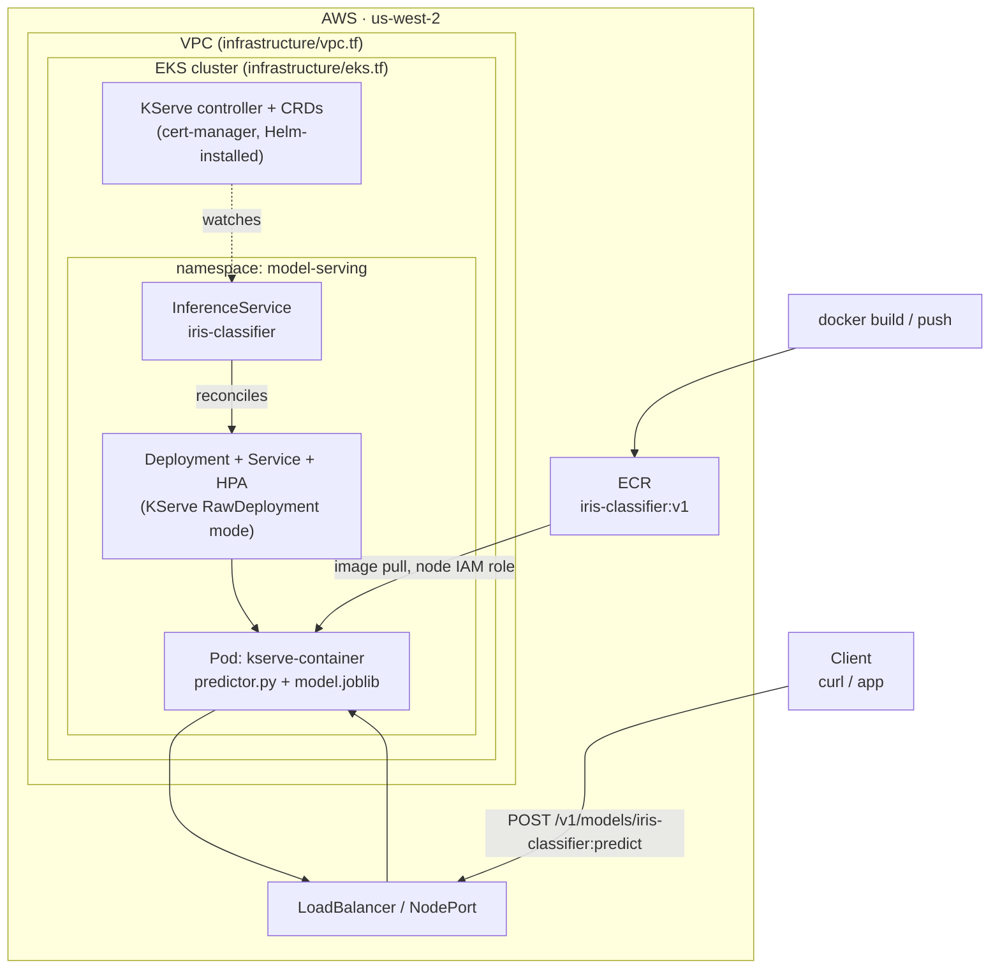

# KServe model deployment

Deploys a model on Amazon EKS using [KServe](https://kserve.github.io/website/), on top of the
sandbox EKS cluster provisioned in [`infrastructure/`](./infrastructure).

## Architecture



**Why RawDeployment mode:** the sandbox cluster is small on purpose (public subnets only,
`t3.medium` nodes, capped at 9 EC2 instances — see `infrastructure/variables.tf`). Knative +
Istio (KServe's default "Serverless" mode) adds a control plane most sandbox clusters don't have
headroom for. `serving.kserve.io/deploymentMode: RawDeployment` makes KServe manage a plain
Deployment/Service/HPA instead, at a fraction of the resource cost — the trade-off is no
scale-to-zero and no Knative revisions.

## Repo layout

```
infrastructure/   Terraform: VPC, EKS cluster, node group, IAM (already in this repo)
model/            Model training code, KServe predictor, Dockerfile
k8s/               Namespace + InferenceService manifests
```

## 1. Provision the cluster

```bash
cd infrastructure
terraform init
terraform apply
aws eks update-kubeconfig --region us-west-2 --name sandbox-eks
```

## 2. Install KServe (RawDeployment mode, no Knative/Istio)

```bash
# cert-manager (KServe's webhook needs it)
kubectl apply -f https://github.com/cert-manager/cert-manager/releases/latest/download/cert-manager.yaml
kubectl wait --for=condition=Available -n cert-manager deployment --all --timeout=180s

# KServe CRDs + controller
helm install kserve-crd oci://ghcr.io/kserve/charts/kserve-crd --version v0.13.1
helm install kserve oci://ghcr.io/kserve/charts/kserve \
  --version v0.13.1 \
  --set kserve.controller.deploymentMode=RawDeployment
```

## 3. Build and push the model image

```bash
cd model
aws ecr create-repository --repository-name iris-classifier --region us-west-2
aws ecr get-login-password --region us-west-2 | \
  docker login --username AWS --password-stdin <ACCOUNT_ID>.dkr.ecr.us-west-2.amazonaws.com

docker build -t <ACCOUNT_ID>.dkr.ecr.us-west-2.amazonaws.com/iris-classifier:v1 .
docker push <ACCOUNT_ID>.dkr.ecr.us-west-2.amazonaws.com/iris-classifier:v1
```

The training step (`train.py`) runs inside the Docker build, so the image ships with
`model.joblib` baked in — no S3 bucket or PVC needed for this demo. Swap that step for
`COPY model.joblib /mnt/models/model.joblib` once you have a real training pipeline.

## 4. Deploy

Edit the `image:` field in `k8s/inferenceservice.yaml` with your account ID and region, then:

```bash
kubectl apply -f k8s/namespace.yaml
kubectl apply -f k8s/inferenceservice.yaml
kubectl get inferenceservice -n model-serving iris-classifier -w
```

## 5. Call it

```bash
kubectl -n model-serving port-forward svc/iris-classifier-predictor 8080:80
curl -X POST http://localhost:8080/v1/models/iris-classifier:predict \
  -H "Content-Type: application/json" \
  -d @k8s/sample-input.json
```

Expected response shape:
```json
{"predictions": [0, 2], "probabilities": [[...], [...]]}
```

(For real internet-facing access, swap `port-forward` for the `LoadBalancer`/ingress path shown
in the diagram — that needs a Service of type `LoadBalancer` or an ingress controller, which
isn't included here to keep the sandbox footprint small.)

## Resource footprint

The predictor container requests `250m CPU / 256Mi` and limits at `500m CPU / 512Mi` —
sized to leave room for `kube-system` and the KServe controller alongside it on a
`t3.medium` (2 vCPU / 4 GiB) node, per `infrastructure/variables.tf`.
